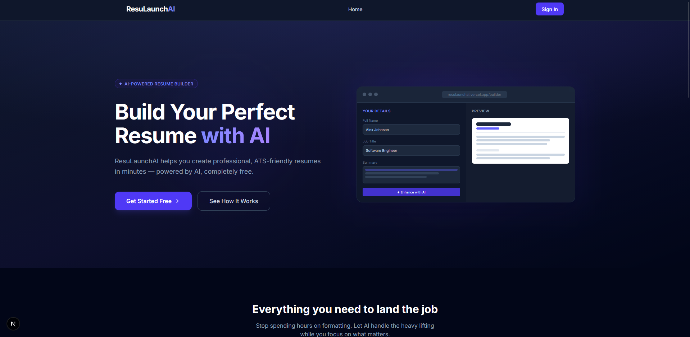
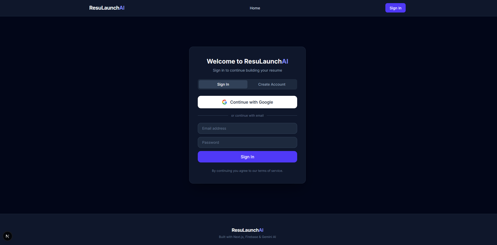
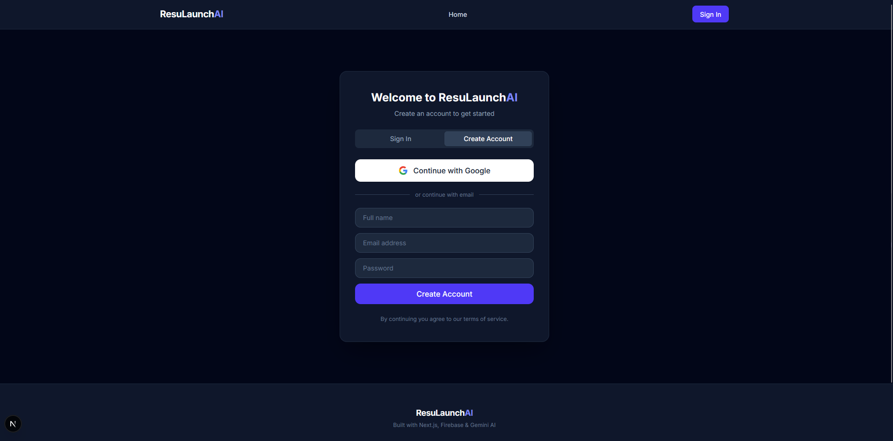
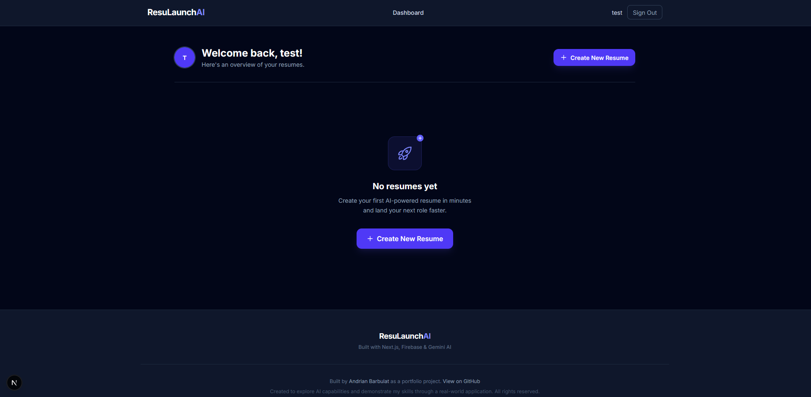
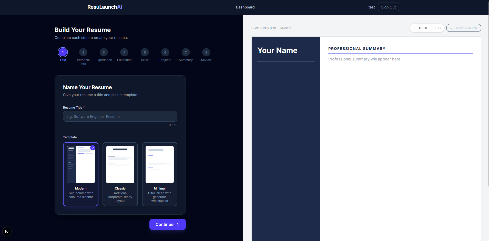

# ResuLaunchAI

An AI-powered resume builder built with Next.js, TypeScript, Firebase, and Google Gemini AI. Create professional, ATS-friendly resumes in minutes completely free.

**Live Demo:** [resulaunchai.vercel.app](https://resulaunchai.vercel.app)

---

## Screenshots







## Features

- AI-powered content generation summaries, bullet points, and skill suggestions
- 3 professional resume templates: Modern, Classic, and Minimal
- Real-time live preview as you type
- PDF export and download (html2canvas + jsPDF)
- Cloud save to Firebase Storage
- Shareable public resume links
- Google Sign-In and email/password authentication
- Dashboard with search, sort, and filter
- Mobile responsive throughout

## Tech Stack

| Layer | Technology |
|-------|-----------|
| Framework | Next.js 14 (App Router) |
| Language | TypeScript |
| Styling | Tailwind CSS |
| Auth + DB + Storage | Firebase |
| AI | Google Gemini API (free tier) |
| PDF | html2canvas + jsPDF |
| Hosting | Vercel |

## Getting Started

### Prerequisites

- Node.js 18+
- A Firebase project with **Authentication**, **Firestore**, and **Storage** enabled
- A free Gemini API key from [aistudio.google.com/apikey](https://aistudio.google.com/apikey)

### Installation

```bash
git clone https://github.com/yourusername/resume-launch-ai.git
cd resume-launch-ai
npm install
```

### Environment Variables

Copy `.env.example` to `.env.local` and fill in your values:

```bash
cp .env.example .env.local
```

| Variable | Where to find it |
|----------|-----------------|
| `NEXT_PUBLIC_FIREBASE_*` | Firebase Console → Project Settings → Your Apps |
| `GEMINI_API_KEY` | [aistudio.google.com/apikey](https://aistudio.google.com/apikey) |

> `GEMINI_API_KEY` is server-side only it is never exposed to the browser.

### Development

```bash
npm run dev
```

Open [http://localhost:3000](http://localhost:3000).

### Build

```bash
npm run build
```

## Firebase Setup

1. Go to [Firebase Console](https://console.firebase.google.com) and create a project
2. **Authentication** → Sign-in method → enable **Google** and **Email/Password**
3. **Firestore Database** → Create database (start in production mode)
4. **Storage** → Get started
5. Apply the security rules from the [`firebase-rules/`](./firebase-rules/) directory:
   - Paste `firestore.rules` into Firestore → Rules
   - Paste `storage.rules` into Storage → Rules
6. After deploying to Vercel, add your `*.vercel.app` URL to **Authentication → Authorized domains**

## Deployment

### Vercel (recommended)

1. Push to GitHub
2. Import the repo at [vercel.com/new](https://vercel.com/new)
3. Add all environment variables from `.env.local` in the Vercel dashboard
4. Deploy Vercel auto-detects Next.js settings

### Pre-Deployment Checklist

- [ ] All environment variables set in Vercel dashboard
- [ ] Firestore security rules applied
- [ ] Firebase Storage security rules applied
- [ ] Vercel deployment URL added to Firebase Authorized Domains
- [ ] Google Sign-In works on the deployed URL
- [ ] AI features work (Gemini API key active)
- [ ] PDF download works
- [ ] Public resume sharing works
- [ ] `npm run build` passes with no errors

## Project Structure

```
src/
├── app/                   # Next.js App Router pages & layouts
│   ├── api/ai/            # Server-side Gemini AI routes
│   ├── builder/           # Resume builder pages
│   ├── dashboard/         # Dashboard page
│   ├── resume/[id]/       # Public resume view
│   └── sign-in/           # Auth page
├── components/            # Shared UI components
│   ├── builder/           # Multi-step builder form
│   ├── dashboard/         # Dashboard-specific components
│   ├── preview/           # Live preview & PDF export
│   └── templates/         # Resume template renderers
├── context/               # React context providers
├── hooks/                 # Custom React hooks
└── lib/                   # Firebase, Gemini, types, utilities
```

## License

MIT
